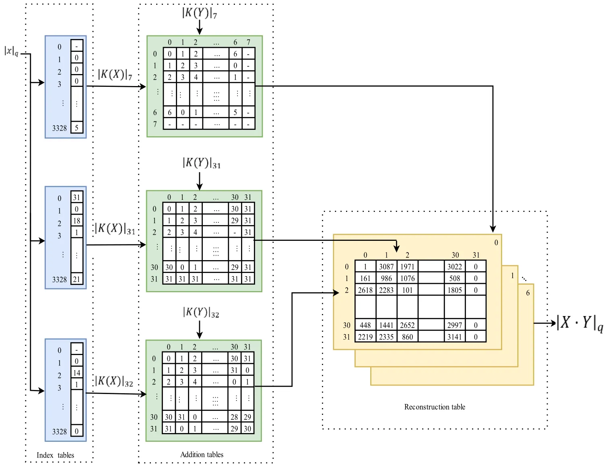
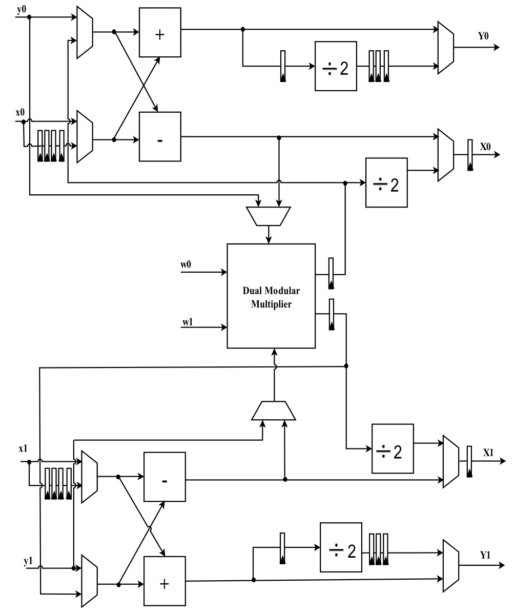
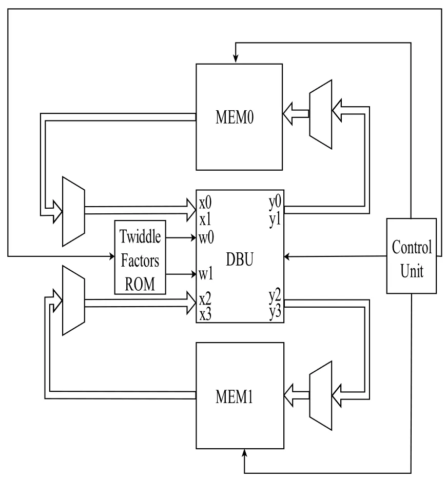
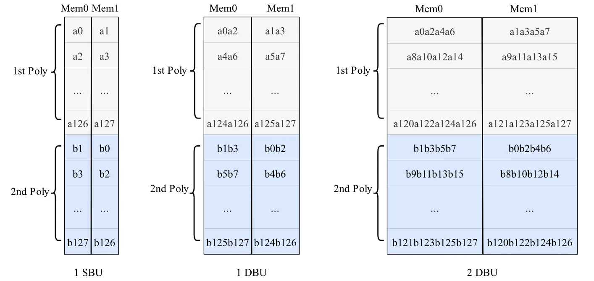

# NTT_Accelerator
High-Speed Polynomials Multiplication HW Accelerator for CRYSTALS-Kyber

## Dual Modular Multiplier

输入的数是 $x_1, y_1$ 和 $x_2, y_2$，$x, y \in \mathbb{Z}_{3329}$，两组数据并行计算，输出的数是 $z_1$ 和 $z_2$，$z = |x \cdot y|_{3329}$。

在电路的内部，例化了7个rom，分别是index7_rom、index31_rom、index32_rom、add7_rom、add31_rom、add32_rom和reconstruct_rom。每个rom都是双端口：包含两个clka、clkb信号端口，两个addra、addrb信号端口，两个douta、doutb信号端口，也就是实现两组输入并行计算，即同时计算x1、y1的模乘和x2、y2的模乘结果z1和z2。

下面解释各rom的数据含义和编排方式：

index7_rom的位宽为3，深度为3329，从第1层到第3329层分别表示0到3328的索引；index7_rom读出的数据记为k7。index31_rom的位宽为5，深度为3329，从第1层到第3329层分别表示0到3328的索引；index7_rom读出的数据记为k31。index32_rom的位宽为5，深度为3329，从第1层到第3329层分别表示0到3328的索引；index32_rom读出的数据记为k32。

add7_rom的位宽为3，深度为64，表示一个8乘8规模的表格，也就是说，第1层到第8层是表格的第一行，第9层到第16层是表格的第二行，以此类推，第56层到第64层是表格的第8行；从add7_rom读出的数据记为q1。add31_rom的位宽为5，深度为1024，表示一个32乘32规模的表格，也就是说，第1层到第32层是表格的第一行，第33层到第64层是表格的第二行，以此类推，第992层到第1024层是表格的第32行；从add31_rom读出的数据记为q2。add32_rom的位宽为5，深度为1024，表示一个32乘32规模的表格，也就是说，第1层到第32层是表格的第一行，第33层到第64层是表格的第二行，以此类推，第992层到第1024层是表格的第32行；从add32_rom读出的数据记为q3。

reconstruct_rom的位宽为12，深度为7168，表示7个规模为32乘32的表格，也就是说，前1024行是第一个表格，其中，第1层到第32层是表格的第一行，第33层到第64层是表格的第二行，以此类推，第992层到第1024层是表格的第32行；从1025-2048是第二个表格，以此类推，从6144行到7168行是第7个表格。在查找该reconstruct_rom时，由q1确定页地址，也就是q1确定第几个表格；q2和q3分别给出q1所选中表格的列地址和行地址。

下面解释电路的行为：

第一步：输入数据x和y，分别根据x和y的值查找三个index7_rom、index31_rom、index32_rom表格，数据的值从0-3328，实际对应的层数为1-3329。例如，x=0，则分别查找index7_rom、index31_rom、index32_rom的第1层，读出的数据记为k7_x，k31_x，k32_x；y=1，则分别查找index7_rom、index31_rom、index32_rom的第2层，读出的数据记为k7_y，k31_y，k32_y。

第二步：使用读出的数据k7_x，k31_x，k32_x和k7_y，k31_y，k32_y分别查找add7_rom、add31_rom、add32_rom，其中x结尾的数据读取相应的行，y结尾的数据读取相应的列。数据的值从0开始，实际物理结构从1开始计数。例如：k7_x = 0，k7_y=0，表示查找add7_rom所表示的8乘8规模的表格的第1行第1列，读出的数据记为q1；k31_x = 1，k31_y=1，表示查找add31_rom所表示的32乘32规模的表格的第2行第2列，读出的数据记为q2；k32_x = 2，k32_y=2，表示查找add32_rom所表示的32乘32规模的表格的第3行第3列，读出的数据记为q3。

第三步：查找reconstruct_rom，由q1确定页地址，也就是q1确定第几个表格；q2和q3分别给出q1所选中表格的列地址和行地址。数据的值从0开始，实际物理结构从1开始计数。例如，q1 = 0，则表示读取reconstruct_rom中的第1个表格，q2=1，q3=2，表示读取第1个表格中的第2行第3列；再举一个例子，q1 = 3，则表示读取reconstruct_rom中的第4个表格，q2=5，q3=6，表示读取第4个表格中的第6行第7列，读出的数据即为输出数据z。

## Dual butterfly unit

一个双蝶形运算单元，输入数据是x1、y1、w1和x2、y2、w2，这两组数据并行计算，输入数据的位宽为12，输出数据是X1、Y1和X2、Y2。这个电路可以实现两种运算功能，分别为：基于CT蝶形的NTT算法和基于GS蝶形的INTT算法，这两种算法都用到了模乘模块、模加模块和模减模块，因此，可以实现模块的复用，两种算法功能是可配置的。

## Top-level design

顶层设计由5个模块组成：MEM0、MEM1、Twiddle Factors ROM、DBU_v2模块和控制单元（Control Unit）。旋转因子（twiddle factors）被预计算并存储在ROM中。DBU模块实现的功能是将输入的两组数据 x1, y1, w1和x2, y2, w2分别通过蝶形计算输出X1, Y1和X2, Y2。控制单元（Control Unit）生成适当的读写地址，并启动NTT、INTT或CWM操作所需的状态机。

### 内存Mem的组织方式：

MEM0和MEM1的内存组织方式，Mem0存储偶数下标的系数，每一个地址存储两个系数，例如，Mem0的第一个位置存储a0和a2，单个系数的数据位宽为12（系数的范围为0-3329），Mem1的第一个位置存储a1和a3，对于系数a由0-127分别存储在Mem0和Mem1的前32行。而对于系数b，Mem0存储计数下标的系数，每一个地址存储两个系数，例如，Mem0的第33行存储b1和b3，Mem1的第33行存储b0和b2，系数b分别存储在第33行到64行。在取数据的时候，a系数从第一行开始取，b系数从第64行开始取，以此实现顺序相反的取数据，以便在CWM过程中实现高效访问。

### Twiddle Factors ROM的组织方式：

ROM存储旋转因子，单个旋转因子的位宽为12，旋转因子从w0-w127，存储的格式为每两个为一行。ROM的数据位宽为24，深度为64。

